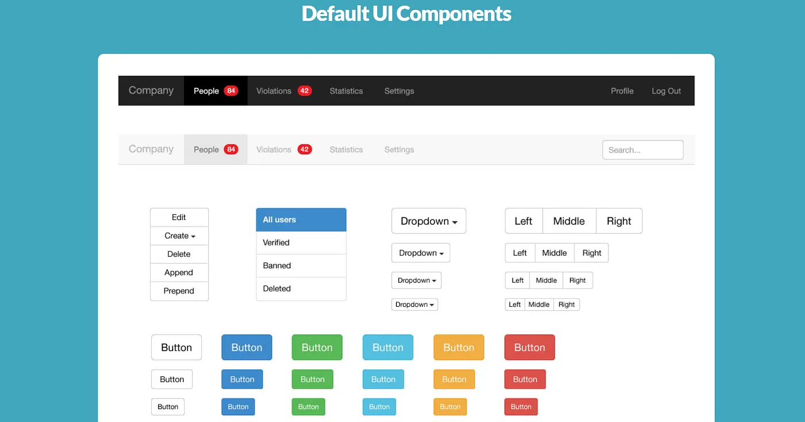

INTRODUCTION:

User interface (UI) frameworks provide pre-written code libraries that standardize the design and behavior of web applications. Among these, Bootstrap 5 is a widely adopted tool for building responsive websites. This essay examines the practical advantages of using Bootstrap 5 compared to writing raw HTML and CSS.

UI FRAMEWORKS:

Writing a web application from scratch using only HTML and CSS requires developers to manually define every stylistic detail. While this approach offers complete control, it requires the developer to manually establish and enforce all design standards. As a project grows, writing custom CSS for every new component often leads to duplicated code, inconsistent spacing, and conflicting style rules. Without a centralized system to manage these styles, maintaining visual consistency becomes increasingly difficult.

UI frameworks solve this problem by providing a unified design, grounding the project in core software engineering principles, reusability and maintainability. Instead of defining exact pixel values and colors for every single element, developers can apply standardized classes. This ensures that buttons, forms, and typography maintain a consistent appearance throughout the application. Furthermore, if a project needs to change its primary brand color, a developer can update a single CSS variable, and the change propagates across every relevant component. This centralized control makes the codebase highly maintainable and reduces the time spent on manual style adjustments.

BOOTSTRAP 5:

Bootstrap 5 provides several technical features that make it a practical choice for modern development. A primary feature is its twelve-column grid system, which allows developers to create complex, responsive layouts efficiently. By assigning classes such as col-md-6, a developer can specify that an element should occupy half the screen width on medium-sized devices and automatically stack on smaller screens. The framework handles the underlying math and cross-browser compatibility, allowing developers to focus on application logic rather than reinventing basic layout mechanics.

Beyond structural layouts, Bootstrap 5 simplifies micro-styling through its utility classes. Instead of writing custom CSS for minor adjustments like margins, padding, or text alignment, developers apply pre-defined classes such as mt-3 or text-center. This keeps the HTML self-contained and eliminates the need to maintain separate stylesheet rules for simple visual tweaks.

Experience:

ICS314 at UH Manoa covered the basic principles of HTML and CSS at a fast pace. Because of this, the transition to Bootstrap didn't cause any frustration, since there wasn't enough time spent writing raw CSS to feel restricted by a pre-built system. Working within a framework does mean our design choices are limited to its predefined layout structures. However, the advantage of the framework is that it allows us to write code much faster. The resulting page are of acceptable quality and save a significant amount of time which is improves workflow.

CONCLUSION:

UI frameworks are a standard tool in professional software engineering. They reduce the need for repetitive, manual CSS coding with a structured, scalable system. By handling responsive layouts and standardizing visual styles, a framework like Bootstrap 5 ensures that applications are built efficiently, maintain visual consistency, and remain easy to update. Adopting these tools is a practical choice for any developer looking to write cleaner, more maintainable code.

AI used to support writing.

Used to correct grammar.

Used to improve sentence structure.