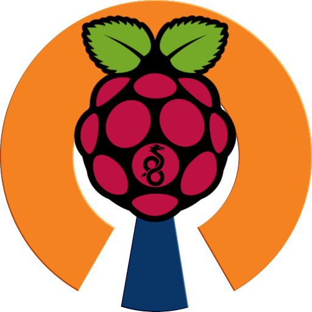

  
  

This project involves a custom networking setup using a Raspberry Pi. In response to Netflix enforcing its password-sharing restrictions, the goal was to allow devices in secondary households to temporarily access the primary home network to satisfy these requirements, without routing high-bandwidth video traffic through the host's internet connection.

Initially, the setup required users to manually connect specific devices to the VPN. To simplify this process, I wrote a basic automation script to run on the user's computer. This script communicates with the home router to activate Policy-Based Routing (PBR) for a specific device's local IP address. This routes the device's traffic through the primary household's PiVPN server just long enough for Netflix to register it as part of the authorized household.

Once access is granted, the script is executed again to instruct the router to disable the routing rule for that device. The device then reverts to its native local network connection for all high-bandwidth streaming, preserving the host network's bandwidth. This temporary connection grants access for approximately one month before the device requires another brief VPN connection for Netflix's periodic location verification.

This project relies entirely on existing open-source and free tools. It utilizes the [PiVPN](http://pivpn.io) installer to configure the server on the Raspberry Pi, and DuckDNS to manage dynamic DNS. Additionally, basic shell scripts are executed on the router to toggle the routing rules. Overall, this setup provided a practical introduction to home network configuration, router policy-based routing, and network automation.

