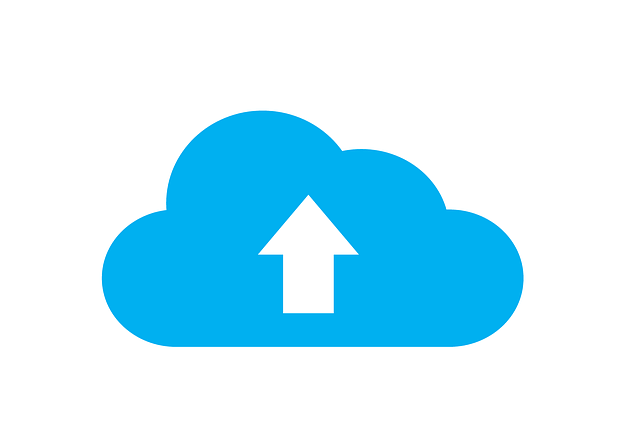

This project focused on building a personal, local cloud storage system using a Raspberry Pi as a private alternative to commercial services like Google Drive. The setup centers around Nextcloud, paired with an external SSD for fast and reliable storage. To allow secure remote access without exposing router ports to the public internet, PiVPN (WireGuard) was used. 
This creates a secure tunnel, making it easy to access files from any device while keeping the home network safely locked down.

The build process was straightforward, relying on well-documented, community-tested tools. It started with installing Raspberry Pi OS, mounting the external SSD, and configuring Nextcloud to use the SSD as its main storage drive. PiVPN was then installed to generate secure client profiles for personal devices. Finally, a simple automated daily backup script was added to copy data to a secondary location as a safeguard.

The result is a reliable, self-hosted setup that requires very little maintenance. It delivers the everyday convenience of a commercial cloud service, but with complete privacy and control over personal data. Overall, it’s a clean, practical deployment that solves the problem without overcomplicating things.
